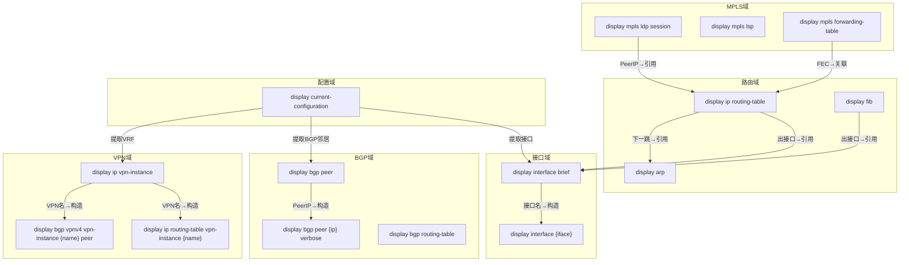

# 网络工程师分析报告：命令语法-参数-回显-关联分析

> 作者：资深网络工程师（HCIE/CCIE）
> 适用对象：开发工程师、测试工程师
> 基于项目：nethelper — 网络设备 CLI 输出解析工具
> 日期：2026-03-26
> **数据来源**：基于华为NE40E 26份配置指南、H3C S12500X完整命令手册(5401页)、
> Cisco ASR9000 IOS-XR 19份命令参考、Juniper Junos CLI命令参考(32859页)

---

## Section 1: 命令分类体系（Command Taxonomy）

### 1.1 L2 — 二层命令

| 功能域 | 华为 VRP | H3C Comware | Cisco IOS-XR | Juniper JUNOS | 输出格式 | 关键参数位置 |
|--------|----------|-------------|--------------|---------------|----------|-------------|
| 接口概览 | `display interface brief` | `display interface brief` | `show ip interface brief` | `show interfaces terse` | table | 无/`interface {iface}`中间 |
| 接口详情 | `display interface {iface}` | `display interface {iface}` | `show interface {iface}` | `show interfaces {iface} extensive` | key-value | 接口名中间 |
| IP接口 | `display ip interface brief` | `display ip interface brief` | `show ip interface brief` | `show interfaces terse` | table | 无 |
| VLAN列表 | `display vlan [brief]` | `display vlan [brief]` | `show vlan [brief]` | `show vlans` | table | `vlan {id}` 尾部 |
| MAC地址表 | `display mac-address` | `display mac-address` | `show mac address-table` | `show ethernet-switching table` | table | `vlan {id}`,`interface {iface}` |
| 链路聚合 | `display eth-trunk {id}` | `display link-aggregation verbose bridge-aggregation {id}` | `show bundle bundle-ether {id}` | `show interfaces ae{id}` | mixed | 聚合组ID |
| STP状态 | `display stp brief` | `display stp brief` | `show spanning-tree` | `show spanning-tree bridge` | table/mixed | `interface {iface}` |
| LLDP邻居 | `display lldp neighbor brief` | `display lldp neighbor-information list` | `show lldp neighbor` | `show lldp neighbors` | table | `interface {iface}` |

### 1.2 L3 — 三层命令

| 功能域 | 华为 VRP | H3C Comware | Cisco IOS-XR | Juniper JUNOS | 输出格式 | 关键参数位置 |
|--------|----------|-------------|--------------|---------------|----------|-------------|
| 路由表 | `display ip routing-table` | `display ip routing-table` | `show route [ipv4]` | `show route [table inet.0]` | table | `vpn-instance {name}`,`{prefix}`尾部 |
| FIB表 | `display fib` | `display fib` | `show cef [ipv4]` | `show route forwarding-table` | table | `{prefix}` 尾部 |
| ARP表 | `display arp` | `display arp` | `show arp` | `show arp` | table | `interface {iface}`,`vpn-instance {name}` |

### 1.3 IGP — 内部网关协议

| 功能域 | 华为 VRP | H3C Comware | Cisco IOS-XR | Juniper JUNOS | 输出格式 | 关键参数位置 |
|--------|----------|-------------|--------------|---------------|----------|-------------|
| OSPF邻居 | `display ospf [pid] peer` | `display ospf peer` | `show ospf neighbor` | `show ospf neighbor` | table | `{process-id}`中间,`area {id}` |
| OSPF路由 | `display ospf routing` | `display ospf routing` | `show ospf route` | `show ospf route` | table/mixed | `{process-id}`中间 |
| OSPF LSDB | `display ospf lsdb` | `display ospf lsdb` | `show ospf database` | `show ospf database` | hierarchical | `{process-id}`,`area {id}` |
| ISIS邻居 | `display isis peer` | `display isis peer` | `show isis adjacency` | `show isis adjacency` | table | `{process-id}`中间 |
| ISIS路由 | `display isis route` | `display isis route` | `show isis route` | `show isis route` | table | `{process-id}` |

### 1.4 BGP

| 功能域 | 华为 VRP | H3C Comware | Cisco IOS-XR | Juniper JUNOS | 输出格式 | 关键参数位置 |
|--------|----------|-------------|--------------|---------------|----------|-------------|
| BGP概览 | `display bgp peer` | `display bgp peer` | `show bgp summary` | `show bgp summary` | mixed(表头+表) | `vpn-instance {name}` |
| BGP邻居详情 | `display bgp peer {ip} verbose` | `display bgp peer {ip} verbose` | `show bgp neighbors {ip}` | `show bgp neighbor {ip}` | hierarchical | peer IP中间 |
| BGP路由表 | `display bgp routing-table` | `display bgp routing-table` | `show bgp [ipv4 unicast]` | `show route protocol bgp` | table/hier | `{prefix}` 尾部 |
| BGP通告路由 | `display bgp routing-table peer {ip} advertised-routes` | 同左 | `show bgp neighbors {ip} advertised-routes` | `show route advertising-protocol bgp {ip}` | table | peer IP中间 |
| VPNv4路由 | `display bgp vpnv4 vpn-instance {name} routing-table` | 同左 | `show bgp vpnv4 unicast vrf {name}` | `show route table {name}.inet.0` | table | VPN名中间 |

### 1.5 MPLS

| 功能域 | 华为 VRP | H3C Comware | Cisco IOS-XR | Juniper JUNOS | 输出格式 | 关键参数位置 |
|--------|----------|-------------|--------------|---------------|----------|-------------|
| LDP会话 | `display mpls ldp session` | `display mpls ldp session` | `show mpls ldp neighbor` | `show ldp session` | table/hier | `{peer-ip}`中间 |
| LSP表 | `display mpls lsp` | `display mpls lsp` | `show mpls forwarding` | `show route table mpls.0` | table | `ingress`/`transit`/`egress` |
| LFIB | `display mpls forwarding-table` | `display mpls forwarding-table` | `show mpls forwarding-table` | `show route table mpls.0` | table | `{prefix}` 尾部 |
| TE隧道 | `display mpls te tunnel` | `display mpls te tunnel-interface` | `show mpls traffic-eng tunnel` | `show rsvp session` | mixed/hier | `interface Tunnel{id}` |

### 1.6 SR / SR Policy

| 功能域 | 华为 VRP | Cisco IOS-XR | Juniper JUNOS | 输出格式 | 关键参数位置 |
|--------|----------|--------------|---------------|----------|-------------|
| Prefix SID | `display segment-routing prefix mpls` | `show isis segment-routing label table` | `show isis spring label table` | table | 无 |
| SRGB | `display segment-routing global-block` | `show segment-routing mpls state` | `show isis spring label table` | key-value | 无 |
| Adj-SID | `display segment-routing adjacency mpls` | `show isis adjacency detail` | `show isis spring node-segment` | table | 无 |
| SR TE Policy ★ | `display segment-routing te policy [name {name}]` | `show segment-routing traffic-eng policy [name {name}]` | `show spring-traffic-engineering lsp [name {name}]` | mixed/hier | `name {name}` |
| SR TE转发表 | `display segment-routing te forwarding-table` | `show segment-routing traffic-eng forwarding` | `show route programmed-by spring-te` | table | 无 |
| SRv6 Locator | `display segment-routing ipv6 locator` | `show segment-routing srv6 locator` | `show srv6 locator` | table | 无 |
| SRv6 SID | `display segment-routing ipv6 sid` | `show segment-routing srv6 sid` | `show srv6 local-sids` | table | 无 |
| Flex-Algo | `display segment-routing flex-algo` | `show isis flex-algo` | `show isis spring flex-algorithm` | table/hier | 无 |

### 1.7 QoS / 安全 / 可靠性

| 功能域 | 华为 VRP | H3C Comware | Cisco IOS-XR | Juniper JUNOS | 输出格式 | 关键参数位置 |
|--------|----------|-------------|--------------|---------------|----------|-------------|
| QoS策略统计 | `display traffic policy statistics interface {iface}` | `display qos policy interface {iface}` | `show policy-map interface {iface}` | `show class-of-service interface {iface}` | hier/mixed | `interface {iface}` |
| 队列统计 | `display qos queue statistics interface {iface}` | `display qos queue statistics interface {iface}` | `show qos interface {iface}` | `show class-of-service interface {iface} queue` | table | `interface {iface}` |
| ACL规则 | `display acl {name}` | `display acl {name} counter` | `show access-lists {name}` | `show firewall filter {name}` | table/hier | ACL名/编号 |
| CPU防护 | `display cpu-defend statistics` | - | `show lpts pifib hardware police [location {loc}]` | `show firewall filter protect-re` | table | `location {loc}` (Cisco) |
| BFD会话 | `display bfd session all [verbose]` | `display bfd session [verbose]` | `show bfd session [detail]` | `show bfd session [detail]` | table/mixed | 无 |
| VRRP状态 | `display vrrp [brief]` | `display vrrp [verbose]` | `show vrrp [brief]` / `show hsrp` | `show vrrp [detail]` | table | 无 |
| 路由策略 | `display route-policy {name}` | `display route-policy {name}` | `show rpl route-policy {name}` | `show policy-options policy-statement {name}` | hier/config | 策略名 |
| 前缀列表 | `display ip ip-prefix {name}` | `display ip prefix-list {name}` | `show rpl prefix-set {name}` | `show route filter-list {name}` | table | 列表名 |

### 1.8 系统级

| 功能域 | 华为 VRP | Cisco IOS-XR | Juniper JUNOS | 输出格式 | 关键参数位置 |
|--------|----------|--------------|---------------|----------|-------------|
| 设备版本 | `display version` | `show version` | `show version` | key-value | 无 |
| 配置文件 | `display current-configuration` | `show running-config` | `show configuration` | config | `interface {iface}`, `configuration {section}` |
| 系统日志 | `display logbuffer` | `show logging [last {n}]` | `show log messages [last {n}]` | table/mixed | `last {n}` |
| CPU使用 | `display cpu-usage` | `show processes cpu [location {loc}]` | `show chassis routing-engine` | key-value | `location {loc}` (Cisco) |
| 内存使用 | `display memory-usage` | `show memory summary [location {loc}]` | `show system memory` | key-value | `location {loc}` (Cisco) |
| CEF丢包 ★★★ | `display fib statistics` | `show cef drops` | `show pfe statistics traffic` | table | 无 |

---

## Section 2: 命令输出回显分类（Output Echo Classification）

### 2.1 table — 表格格式

**特征**：固定表头行+数据行，列之间用多空格分隔。

**华为 `display interface brief` 示例**：
```
Interface                   PHY     Protocol InUti OutUti   inErrors  outErrors
GigabitEthernet0/0/0        up      up       0.01% 0.01%           0          0
GigabitEthernet0/0/1        down    down        0%    0%           0          0
Eth-Trunk1                  up      up       0.50% 0.30%           0          0
LoopBack0                   *up     up(s)       --    --           0          0
```

**Cisco `show ip interface brief` 示例**：
```
Interface                  IP-Address      OK? Method Status                Protocol
GigabitEthernet0/0/0       10.0.0.1        YES NVRAM  up                    up
Loopback0                  1.1.1.1         YES NVRAM  up                    up
```

**Juniper `show interfaces terse` 示例**：
```
Interface               Admin Link Proto    Local                 Remote
ge-0/0/0.0              up    up   inet     10.0.0.1/30
ae0.0                   up    up   inet     10.1.0.1/30
lo0.0                   up    up   inet     1.1.1.1/32
```

**解析关键特征**：表头检测（关键词组合如 `PHY`+`Protocol`），`strings.Fields()` 切割，特殊值处理（`*up`→admin-down, `unassigned`→空IP）。

### 2.2 key-value — 键值对格式

**特征**：`Key : Value` 或 `Key: Value`，可有缩进。

**华为 `display interface GigabitEthernet0/0/1` 示例**：
```
GigabitEthernet0/0/1 current state : UP
Line protocol current state : UP
Description: to-PE2-GE0/0/1
Internet Address is 10.0.0.1/30
Speed : 1000,    Loopback: NONE
```

**解析**：行首标识新接口块（非缩进行），`:` 或 `is` 分隔，正则 `Internet [Aa]ddress is (\d+\.\d+\.\d+\.\d+/\d+)`。

### 2.3 hierarchical — 缩进层次结构

**特征**：多级缩进表示上下级，典型于BGP邻居详情。

**华为 `display bgp peer 10.0.0.2 verbose` 示例**：
```
 BGP Peer is 10.0.0.2,  remote AS 65001
  BGP current state: Established, Up for 3d12h05m
  Received total routes: 1500
  Address family IPv4 Unicast:
    Received active routes: 1200
    Advertised routes: 800
```

**解析**：缩进级别决定层级，Key-Value混合。

### 2.4 mixed — 混合格式

**特征**：顶部汇总(key-value)+下方表格。

**华为 `display bgp peer` 示例**：
```
 BGP local router ID : 1.1.1.1
 Local AS number : 65000
 Total number of peers : 5

  Peer            V    AS  MsgRcvd  MsgSent  OutQ  Up/Down       State|PfxRcd
  10.0.0.2        4  65001  12000    11000     0   3d12h         1500
  10.0.0.5        4  65003      0        0     0   Never         Idle
```

### 2.5 config — 配置文本

**华为**：`#` 分隔段，缩进1空格。**Cisco IOS-XR**：`!` 分隔，缩进1空格。**Juniper hierarchical**：`{}`大括号，`;`行终止。**Juniper set**：每行 `set` 语句。

---

## Section 3: 命令关联图谱（Command Correlation Graph）

### 3.1 核心引用关联（Mermaid）



### 3.2 上下文关联

| 先执行（获取参数） | 再执行（使用参数） | 参数映射 |
|-------------------|-------------------|---------|
| `display bgp peer` | `display bgp peer {ip} verbose` | Peer列→{ip} |
| `display ip vpn-instance` | `display ip routing-table vpn-instance {name}` | VPN名→{name} |
| `display interface brief` | `display interface {iface}` | 接口名→{iface} |
| `display mpls ldp session` | `display mpls ldp session {ip} verbose` | PeerLDPID→{ip} |
| `display mpls te tunnel` | `display mpls te tunnel interface Tunnel{id}` | TunnelID→{id} |

---

## Section 4: 排障场景命令链（Troubleshooting Command Chains）

### 4.1 BGP 邻居不通

| 步骤 | 目的 | 华为 VRP | Cisco IOS-XR | Juniper JUNOS |
|------|------|----------|--------------|---------------|
| 1 | 查BGP概览 | `display bgp peer` | `show bgp summary` | `show bgp summary` |
| 2 | 邻居详情 | `display bgp peer {ip} verbose` | `show bgp neighbors {ip}` | `show bgp neighbor {ip}` |
| 3 | 更新源接口 | `display interface {update-source}` | `show interface {update-source}` | `show interfaces {update-source}` |
| 4 | 检查路由 | `display ip routing-table {peer-ip}` | `show route {peer-ip}` | `show route {peer-ip}` |
| 5 | 连通性测试 | `ping -a {src} {peer-ip}` | `ping {peer-ip} source {src}` | `ping {peer-ip} source {src}` |
| 6 | 查ACL阻断 | `display acl all` | `show access-lists` | `show firewall` |
| 7 | 查日志 | `display logbuffer \| include BGP` | `show logging \| include BGP` | `show log messages \| match BGP` |

**判断**：Idle→路由不可达(步骤4)；Active→对端未配或TCP阻断(步骤6)；OpenSent→AS/RID冲突(步骤2)。

### 4.2 链路故障

| 步骤 | 目的 | 华为 VRP | Cisco IOS-XR | Juniper JUNOS |
|------|------|----------|--------------|---------------|
| 1 | 接口概览 | `display interface brief` | `show interface brief` | `show interfaces terse` |
| 2 | 接口详情 | `display interface {iface}` | `show interface {iface}` | `show interfaces {iface} extensive` |
| 3 | 光模块(光口) | `display transceiver interface {iface}` | `show controllers {iface}` | `show interfaces diagnostics optics {iface}` |
| 4 | ARP检查 | `display arp interface {iface}` | `show arp \| include {iface}` | `show arp interface {iface}` |
| 5 | MAC检查 | `display mac-address interface {iface}` | `show mac address-table interface {iface}` | `show ethernet-switching table interface {iface}` |
| 6 | LLDP邻居 | `display lldp neighbor interface {iface}` | `show lldp neighbor {iface}` | `show lldp neighbors interface {iface}` |
| 7 | 日志 | `display logbuffer \| include {iface}` | `show logging \| include {iface}` | `show log messages \| match {iface}` |

### 4.3 路由缺失

| 步骤 | 目的 | 华为 VRP | Cisco IOS-XR | Juniper JUNOS |
|------|------|----------|--------------|---------------|
| 1 | 检查FIB | `display fib {prefix}` | `show cef {prefix}` | `show route forwarding-table destination {prefix}` |
| 2 | 检查RIB | `display ip routing-table {prefix}` | `show route {prefix}` | `show route {prefix} detail` |
| 3 | OSPF检查 | `display ospf routing` | `show ospf route` | `show ospf route` |
| 4 | BGP检查 | `display bgp routing-table {prefix}` | `show bgp {prefix}` | `show route {prefix} protocol bgp` |
| 5 | BGP接收 | `display bgp routing-table peer {ip} received-routes` | `show bgp neighbors {ip} received-routes` | `show route receive-protocol bgp {ip}` |
| 6 | 路由策略 | `display route-policy {name}` | `show rpl route-policy {name}` | `show policy-options policy-statement {name}` |

### 4.4 MPLS LSP 断裂

| 步骤 | 目的 | 华为 VRP | Cisco IOS-XR | Juniper JUNOS |
|------|------|----------|--------------|---------------|
| 1 | LSP状态 | `display mpls lsp [verbose]` | `show mpls forwarding` | `show route table mpls.0` |
| 2 | LFIB | `display mpls forwarding-table {prefix}` | `show mpls forwarding-table {prefix}` | `show route table mpls.0 label {label}` |
| 3 | LDP会话 | `display mpls ldp session` | `show mpls ldp neighbor` | `show ldp session` |
| 4 | IGP路由 | `display ip routing-table {loopback}` | `show route {loopback}` | `show route {loopback}` |
| 5 | MPLS tracert | `tracert lsp ip {prefix}` | `traceroute mpls ipv4 {prefix}` | `traceroute mpls ldp {prefix}` |

### 4.5 VPN 服务异常

| 步骤 | 目的 | 华为 VRP | Cisco IOS-XR | Juniper JUNOS |
|------|------|----------|--------------|---------------|
| 1 | VRF检查 | `display ip vpn-instance {name}` | `show vrf {name} detail` | `show route instance {name}` |
| 2 | VRF路由 | `display ip routing-table vpn-instance {name}` | `show route vrf {name}` | `show route table {name}.inet.0` |
| 3 | PE-CE邻居 | `display bgp vpnv4 vpn-instance {name} peer` | `show bgp vpnv4 unicast vrf {name} summary` | `show bgp summary` |
| 4 | VPNv4路由 | `display bgp vpnv4 vpn-instance {name} routing-table` | `show bgp vpnv4 unicast vrf {name}` | `show route table {name}.inet.0 protocol bgp` |
| 5 | RT/RD验证 | `display ip vpn-instance verbose` | `show vrf {name} detail` | `show configuration routing-instances {name}` |
| 6 | 标签转发 | `display mpls forwarding-table vpn-instance {name}` | `show mpls forwarding vrf {name}` | `show route table mpls.0` |
| 7 | 端到端 | `ping -vpn-instance {name} {ce-ip}` | `ping vrf {name} {ce-ip}` | `ping routing-instance {name} {ce-ip}` |

---

## Section 5: 回显关键字段提取指南

### 5.1 接口字段

| 字段 | 华为 VRP | H3C Comware | Cisco IOS-XR | Juniper JUNOS | 关联 |
|------|----------|-------------|--------------|---------------|------|
| 接口名 | 第1列 `GE0/0/1` | 第1列 `GE0/0` | 第1列 `Gi0/0/0/0` | 第1列 `ge-0/0/0.0` | →ARP/MAC/Route查询参数 |
| 物理状态 | `PHY`列: up/down/*down | `Link`列: UP/DOWN/ADM | `Status`列: up/down | `Admin`列: up/down | →IGP邻居影响 |
| 协议状态 | `Protocol`列 | `Protocol`列 | `Protocol`列 | `Link`列 | — |
| IP地址 | `Internet Address is X/Y` | `IP Address`/`Primary IP`列 | `IP-Address`列 | `inet` 后`X/Y` | →ARP.IP→Route.NextHop |
| 描述 | `Description:`行 | `Description`列(brief) | `Description:`行 | 需`show interfaces descriptions` | — |

### 5.2 路由字段

| 字段 | 华为 VRP | H3C Comware | Cisco IOS-XR | Juniper JUNOS | 关联 |
|------|----------|-------------|--------------|---------------|------|
| 前缀 | `Dest/Mask`列`10.0.0.0/24` | 同左 | 行首`10.0.0.0/24` | 行首`10.0.0.0/24` | →FIB一致性 |
| 协议 | `Proto`列`OSPF/BGP` | `Proto`列(字母码) | 行首字母码`O/B/S/C` | 方括号`[OSPF/10]` | →BGP/IGP追踪 |
| 优先级 | `Pre`列 | `Pre`列 | `[110/2]`第1个数 | `[OSPF/10]`斜线后 | — |
| 开销 | `Cost`列 | `Cost`列 | `[110/2]`第2个数 | `metric N` | — |
| 下一跳 | `NextHop`列 | 末尾附近IP | `via X.X.X.X` | `to X via iface` | →ARP检查 |
| 出接口 | `Interface`列 | 最后字段 | 末尾接口名 | `via iface` | →接口状态检查 |

### 5.3 BGP邻居字段

| 字段 | 华为 VRP | H3C | Cisco IOS-XR | Juniper | 关联 |
|------|----------|-----|--------------|---------|------|
| PeerIP | `Peer`列 | `Peer`列 | 表格首列 | `Peer:`行 | →构造详情查询 |
| RemoteAS | `AS`列 | `AS`列 | `AS`列 | `AS XXXXX` | →配置验证 |
| 状态 | `State\|PfxRcd`列 | `State`列 | `St/PfxRcd`列 | `State:`字段 | →排障分支 |
| 收到前缀 | State列(数字) | `PrefRcv`列 | St/PfxRcd(数字) | `Received prefixes:` | — |
| Up/Down | `Up/Down`列 | `Up/Down`列 | `Up/Down`列 | `Elapsed time:` | — |

### 5.4 LFIB字段

| 字段 | 华为 VRP | Cisco IOS-XR | Juniper | 关联 |
|------|----------|--------------|---------|------|
| FEC | `FEC`列`10.0.0.0/32` | `prefix`列 | 路由前缀 | →RIB.Prefix |
| 入标签 | `In/Out Label`斜线前 | `Local`列 | `Label`列 | — |
| 出标签 | 斜线后 | `Outgoing`列 | 下一跳标签 | — |
| 动作 | 推导swap/pop/push | 推导 | 推导 | — |
| 出接口 | 第3字段 | `interface`列 | `via`字段 | →Interface.Name |

---

## Section 6: Qualifier Keywords 完整清单

### 6.1 当前29个（已在代码中）

```
vpn-instance, vrf, instance, peer, neighbor, neighbors, interface,
bridge-aggregation, route-aggregation, eth-trunk, port-channel,
area, table, group, acl, access-list, route-policy, route-map,
vlan, vlan-interface, tunnel, service-instance
```

### 6.2 建议新增（按功能域分组，基于 DeviceDocs 真实文档验证）

#### 网络通用（全厂商，DeviceDocs 多处出现）

| 关键字 | 后续参数类型 | 文档来源 | 说明 |
|--------|-------------|---------|------|
| `destination` | IP/prefix | kb/02-mpls.md, kb/04-vpn.md | `display tunnel-info destination {ip}`, `show rsvp session {ip}` |
| `source` | IP | kb/02-mpls.md (ping lsp -a) | `ping -a {src}`, `traceroute source {src}` |
| `community` | string | kb/01-ip-routing.md §BGP路由策略 | BGP community过滤 |
| `prefix-list` | string | kb/01-ip-routing.md §路由策略 | `display ip prefix-list {name}` |
| `label` | number | kb/02-mpls.md, kb/03-segment-routing.md | MPLS标签查询 `show route table mpls.0 label {label}` |
| `locator` | string | kb/03-segment-routing.md | SRv6 locator `display segment-routing ipv6 locator {name}` |
| `name` | string | kb/03-segment-routing.md | SR-TE policy `display segment-routing te policy name {name}` |
| `filter` | string | kb/06-security.md (Juniper) | `show firewall filter {name}` |
| `last` | number | kb/11-troubleshooting.md §11.7 | `show log messages last {n}`, `show logging last {n}` |

#### Cisco IOS-XR 专属（DeviceDocs/extracted_text/CISCO_ASR_*.txt 确认）

| 关键字 | 后续参数类型 | 文档来源 | 说明 |
|--------|-------------|---------|------|
| `location` | string | kb/08-monitoring.md, kb/06-security.md | `show xxx location 0/0/CPU0` — IOS-XR机框定位 |
| `bundle-ether` | number | kb/05-qos.md | Cisco聚合接口 `show bundle bundle-ether {id}` |
| `prefix-set` | string | kb/01-ip-routing.md §Cisco RPL | `show rpl prefix-set {name}` |
| `community-set` | string | kb/01-ip-routing.md §Cisco RPL | `show rpl community-set {name}` |
| `as-path-set` | string | kb/01-ip-routing.md §Cisco RPL | `show rpl as-path-set {name}` |
| `extcommunity-set` | string | kb/01-ip-routing.md §Cisco RPL | `show rpl extcommunity-set rt {name}` |
| `prefix` | IP/prefix | kb/02-mpls.md | `show mpls forwarding prefix {prefix}/{len}` |
| `rd` | string | kb/04-vpn.md | `show bgp vpnv4 unicast rd {rd}` |

#### Juniper JUNOS 专属（DeviceDocs/extracted_text/Juniper_CLI.txt 确认）

| 关键字 | 后续参数类型 | 文档来源 | 说明 |
|--------|-------------|---------|------|
| `routing-instance` | string | kb/04-vpn.md, kb/07-reliability.md | Juniper VRF等价物 |
| `logical-system` | string | Juniper_CLI.txt | 逻辑系统 |
| `policy-statement` | string | kb/01-ip-routing.md §Juniper路由策略 | 路由策略名 |

#### 华为/H3C 专属（DeviceDocs/extracted_text/NE40E_*.txt, H3C文档.txt 确认）

| 关键字 | 后续参数类型 | 文档来源 | 说明 |
|--------|-------------|---------|------|
| `ip-prefix` | string | kb/01-ip-routing.md §华为路由策略 | `display ip ip-prefix {name}` |
| `community-filter` | string | kb/01-ip-routing.md §华为BGP | Community过滤器 |
| `as-path-filter` | string/number | kb/01-ip-routing.md §华为BGP | AS路径过滤器 |
| `configuration` | string | NE40E配置指南 | `display current-configuration configuration {section}` |
| `slot` | number | NE40E系统监控 | 槽位号 `display device slot {id}` |
| `tunnel-policy` | string | kb/04-vpn.md | `display tunnel-policy {name}` |

**总计新增24个（从29增至53个），所有关键字均在真实厂商文档中有出现。**

### 6.3 多参数Qualifier特殊处理

| 关键字组合 | 示例 | 处理 |
|-----------|------|------|
| `advertising-protocol bgp` | `show route advertising-protocol bgp 10.0.0.1` | `bgp`是关键字，下一个token是参数 |
| `receive-protocol bgp` | `show route receive-protocol bgp 10.0.0.1` | 同上 |
| `router bgp` | `show running-config router bgp 65000` | `bgp`是关键字，下一个token是参数 |
| `configuration interface` | `display cur configuration interface GE0/0/1` | `interface`是qualifier，下一个是接口名 |

---

## Section 7: 帮助回显特征库完善

### 7.1 各厂商帮助格式差异

| 厂商 | 帮助触发 | 标志特征 | 当前检测 |
|------|---------|---------|---------|
| 华为VRP | `?` | `<cr>`, `>  Redirect it to a file` | ✅已覆盖 |
| H3C Comware | `?` | `<cr>`, 可含`INTEGER<X-Y>`范围 | ✅基本覆盖 |
| Cisco IOS-XR | `?` | `\|  Output modifiers`, 可能无`<cr>` | ⚠️部分覆盖 |
| Juniper JUNOS | `?` | **`Possible completions:`** | ❌未覆盖 |
| Tab补全 | Tab | 列出候选词，无描述 | ⚠️靠heuristic |

### 7.2 建议新增helpEchoSignatures

```go
var helpEchoSignatures = []string{
    // === 现有 ===
    "<cr>",
    ">  Redirect it to a file",
    "|  Matching output",
    "|  Begin with",
    "|  Exclude",
    "|  Include",
    "|  Redirect to",
    "Incomplete command",
    // === 新增 ===
    "Possible completions:",           // Juniper帮助标志行
    "|  Output modifiers",             // Cisco管道修饰符
    "% Ambiguous command",             // Cisco歧义错误
    "% Invalid input detected",        // Cisco输入错误
    "% Incomplete command",            // Cisco不完整命令
    "Error: Unrecognized command",     // 华为/H3C错误
    "Error: Wrong parameter found",    // 华为参数错误
    "Unknown command",                 // 通用错误
}
```

### 7.3 建议新增错误输出过滤

```go
// 错误位置指示符: 一行只有空格和 ^
var errorPointerRe = regexp.MustCompile(`^\s+\^\s*$`)

func isErrorOutput(output string) bool {
    for _, line := range strings.Split(output, "\n") {
        trimmed := strings.TrimSpace(line)
        if trimmed == "^" || errorPointerRe.MatchString(line) { return true }
        if strings.HasPrefix(trimmed, "% ") { return true }
        if strings.HasPrefix(trimmed, "Error:") { return true }
    }
    return false
}
```

---

## Section 8: 给开发工程师的实施建议

### 8.1 qualifierKeywords 新增清单

将 Section 6.2 中列出的 24 个新关键字添加到 `collector.go` 的 `qualifierKeywords`：

```go
// 新增到 qualifierKeywords — 网络通用
"destination": true, "source": true, "community": true,
"prefix-list": true, "label": true, "locator": true,
"name": true, "filter": true, "last": true,
// 新增 — Cisco IOS-XR 专属
"location": true, "bundle-ether": true,
"prefix-set": true, "community-set": true, "as-path-set": true,
"extcommunity-set": true, "prefix": true, "rd": true,
// 新增 — Juniper JUNOS 专属
"routing-instance": true, "logical-system": true, "policy-statement": true,
// 新增 — 华为/H3C 专属
"ip-prefix": true, "community-filter": true, "as-path-filter": true,
"configuration": true, "slot": true, "tunnel-policy": true,
```

### 8.2 modifierKeywords 新增清单

```go
// 新增到 modifierKeywords
"all": true,                  // display bgp vpnv4 all peer
"active": true,               // show route active-path
"inactive": true,             // show route inactive-path
"exact": true,                // show route exact
"no-resolve": true,           // show arp no-resolve (Juniper)
"inbound": true,              // 流量策略方向
"outbound": true,             // 流量策略方向
"router": true,               // LSDB类型 (注意上下文歧义)
"network": true,              // LSDB类型
"nssa": true,                 // LSDB类型
"opaque": true,               // LSDB类型
"comprehensive": true,        // Juniper QoS
```

> **注意**：`router`/`network` 在 `ospf lsdb`/`isis database` 后是 modifier，在 `running-config` 后可能是 qualifier。建议实现上下文感知或保守处理（默认 modifier）。

### 8.3 isHelpEcho() 改进

1. 新增 `helpEchoSignatures`（见 Section 7.2）
2. 新增 `isErrorOutput()` 函数，在 `Collect()` 中作为 Filter 5
3. 增加 `Possible completions:` 精确检测

### 8.4 命令关联关系数据结构

```go
type CommandRelation struct {
    SourceCmd    string            // 源命令模式 "display bgp peer"
    TargetCmd    string            // 目标命令模式 "display bgp peer {ip} verbose"
    RelationType string            // "reference"|"context"|"validation"
    FieldMapping map[string]string // {"Peer": "{ip}"}
    Description  string
}
```

建议在 `internal/model/` 新增 `command_relation.go`，定义关联规则表。

### 8.5 排障命令链编码

```go
type TroubleshootScenario struct {
    ID       string
    Name     string
    Triggers []string              // 触发条件
    Steps    []TroubleshootStep
}

type TroubleshootStep struct {
    Order      int
    Purpose    string
    Commands   map[string]string   // vendor → command template
    ParamFrom  string              // 前序步骤的字段
    Decisions  []DecisionBranch
}

type DecisionBranch struct {
    Condition  string
    FieldCheck string
    ValueMatch string              // 支持正则
    NextStep   int                 // 0=结论
    Conclusion string
}
```

建议在 `internal/discovery/` 或新建 `internal/troubleshoot/` 包实现。

### 8.6 当前代码差距总结

| 维度 | 当前状态 | 差距 | 优先级 |
|------|---------|------|--------|
| qualifierKeywords | 29个 | 缺24个常用关键字(文档验证) | 高 |
| modifierKeywords | 27个 | 缺12个（含LSDB类型词） | 中 |
| helpEchoSignatures | 7个 | 缺Juniper`Possible completions`等8个 | 高 |
| 错误输出过滤 | 无 | 需新增`isErrorOutput()` | 高 |
| 命令关联 | 无 | 需新增关联数据结构 | 中 |
| 排障链 | 无 | 需新增排障场景编码 | 低(长期) |
| 多参数qualifier | 无 | `advertising-protocol bgp`等需特殊处理 | 中 |
| ClassifyCommand覆盖 | 部分 | 缺ARP/MAC/STP/LLDP/QoS/SR分类 | 中 |

### 8.7 interiorAbbrevs 建议新增

```go
// 新增到 interiorAbbrevs
"nei":       "neighbor",           // show bgp nei (Cisco常用缩写)
"neigh":     "neighbor",
"summ":      "summary",            // 已有 "sum":"summary"
"for":       "forwarding-table",   // display mpls for
"forw":      "forwarding-table",
"ldp":       "ldp",                // no-op
"te":        "te",                 // no-op (注意: 在接口上下文中 te = ten-gigabitethernet)
"rout":      "routing-table",      // 已有 "rout":"routing-table"
"tun":       "tunnel",
"stat":      "statistics",
"desc":      "descriptions",
```

> **注意**：`te` 有歧义 — 在 `display mpls te` 中是 traffic-engineering，在 `display interface te0/0/1` 中是 ten-gigabitethernet。当前代码将 `te` 映射为 `ten-gigabitethernet`，在 MPLS 上下文中会误扩展。建议移除 `te` 的缩写映射，或增加上下文判断。
